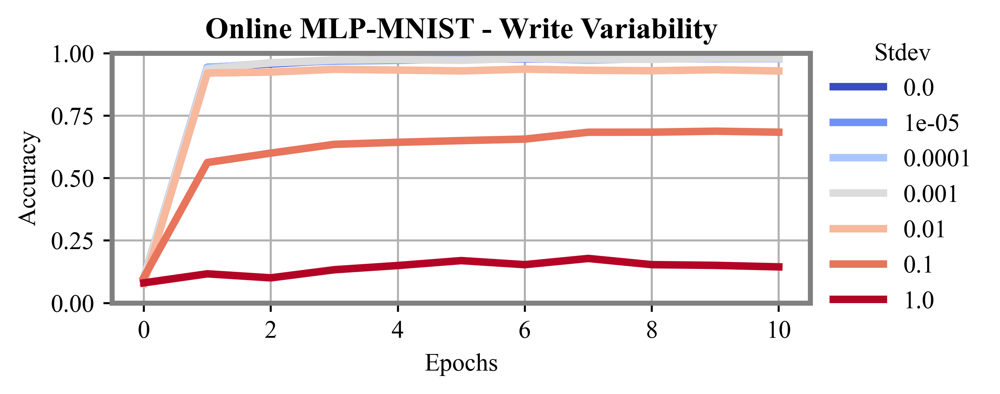
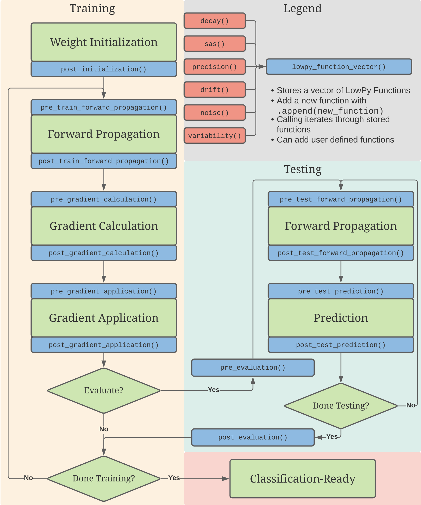

# Welcome to LowPy (Pre-release)!
<p align="center"></p>

**LowPy** is a high level GPU simulator of low level device characteristics in machine algorithms. It seeks to streamline the investigation process when considering memristive and other novel devices for implementing a machine learning algorithm in hardware. By using the familiar [Keras](https://keras.io) syntax, it will be second nature to write GPU-optimized code to push your algorithm to its limits.

# System Requirements
LowPy was designed with Python 3, and has not been tested on previous versions of Python. Beyond this, if you can run [TensorFlow](https://www.tensorflow.org) + [Keras](https://keras.io), you can run LowPy. If you can run [TensorFlow with GPU support](https://www.tensorflow.org/install/gpu), you can run LowPy with GPU support. While it is technically possible to run TensorFlow and LowPy, it is fairly challenging to set up, and has not yet been tested with LowPy.

# Installation
To install the latest version of LowPy, use `pip`:
```
pip install lowpy
```

# Using LowPy: An Example
LowPy takes an existing model defined via the [Keras Functional API](https://keras.io/guides/functional_api/) and manipulates the user-selected network weights during the fitting, validation, and/or evaluation phases. As an example, let's walk through the simulation of device variability of a Multi-Layer Perceptron (MLP) as it is fitted and evaluated against the [MNIST handwritten digits dataset](http://yann.lecun.com/exdb/mnist/).

## Import libraries
To start, let's import Tensorflow, Numpy, and our MNIST dataset.
```Python
import tensorflow as tf
import numpy as np
import lowpy as lp

(x_train, y_train), (x_test, y_test) = tf.keras.datasets.mnist.load_data()
batch_size    = 32
x_train       = np.reshape(x_train, (-1, 784)) / 255 # Flatten and normalize
x_test        = np.reshape(x_test, (-1, 784)) / 255 # Flatten and normalize
```

## Define hyperparameters
In this example, we will simulate 7 MLP variants, all with differing amounts of write variability, over 5 epochs of fitting.
```Python
epochs = 5
batch_size = 32
variants = 7
# Define variability_stdev = [0 1e-5 1e-4 1e-3 1e-2 1e-1 1e0]:
variability_stdev = np.logspace(-1*variants+2,0,variants-1)
variability_stdev = np.insert(variability_stdev,0,0,axis=0)
```
Using `numpy` allows for quick alteration of the number of variants simulated.

## Tracking performance metrics
Being research focused, LowPy outputs `.csv` files or performance metrics as the network is fitted to and evaluated against a dataset. In order to ensure that the metrics are not overwritten as new variants are processed, the user must track the metrics outside of the variant loop:
```python
history = lp.metrics()
```

## Variant Loop
```python
for v in range(variants): # 7 variants total
```

### Define a model
Our MLP, optimizer, and loss function can be defined and compiled via the Keras functional API:
``` python
    inputs = tf.keras.Input(shape=(784,), name="input")
    hidden = tf.keras.layers.Dense(533, activation="relu", name="lowpy-hidden")(inputs)
    outputs = tf.keras.layers.Dense(10, name="lowpy-output")(hidden)

    model = tf.keras.Model(inputs=inputs, outputs=outputs)
    optimizer = tf.keras.optimizers.Adam()
    loss_function = tf.keras.losses.SparseCategoricalCrossentropy(from_logits=True)

    model.compile(optimizer,loss_function,metrics=[tf.keras.metrics.SparseCategoricalAccuracy()])
```

### Configure LowPy simulator
```python
    simulator = lp.wrapper(history, variability_stdev=variability_stdev[v])
    simulator.wrap(model, optimizer, loss_function)
    simulator.post_gradient_application = [
        simulator.write_variability
    ]
    simulator.plot(variability_stdev)
```

### Fit model with GPU
```python
    with tf.device('/GPU:0'):
            simulator.fit(x=x_train, y=y_train, batch_size=batch_size, epochs=epochs, variant=drop_threshold[v], validation_split=0.1)
```

## Results
Console output for first variant:
```
--------------------------
Evaluation:      |################################| 6000/6000
Variant:  0.0
Baseline        Loss:  2.3620   Accuracy:  7.08 %
Epoch 1          |████████████████████████████████| 1688/1688 - 0s      Loss: 2.3620    Accuracy: 7.08%
Evaluation:      |################################| 6000/6000

Epoch 2          |████████████████████████████████| 1688/1688 - 0s      Loss: 0.0944    Accuracy: 96.90%
Evaluation:      |################################| 6000/6000

Epoch 3          |████████████████████████████████| 1688/1688 - 0s      Loss: 0.0908    Accuracy: 97.02%
Evaluation:      |################################| 6000/6000

Epoch 4          |████████████████████████████████| 1688/1688 - 0s      Loss: 0.0815    Accuracy: 97.50%
Evaluation:      |################################| 6000/6000

Epoch 5          |████████████████████████████████| 1688/1688 - 0s      Loss: 0.0809    Accuracy: 97.90%
Evaluation:      |################################| 6000/6000

        Final loss:  0.08197149         Accuracy:  98.0 %
--------------------------
```
`Accuracy.csv` file of all variants:
```csv
,0.0,1e-05
0,0.07083333333333333,0.11633333333333333
1,0.969,0.9591666666666666
2,0.9701666666666666,0.9736666666666667
3,0.975,0.9746666666666667
4,0.979,0.97
5,0.98,

```
Example plot:
<p align="center"></p>

# Event Driven Architecture
There are a number of nonidealities that can occur during fitting, validation, evaluation, and even just during an inference, at various times. A device with notable write variability, for example, will cause varied weights to occur anytime the device is written to. A device with notable drift will result in varied weights anytime a read operation occurs. This is handled using a number different events, shown in the blue `function_vectors` below.

<p align="center"></p>

For instance, in our MLP example above, we alter the weights after they are updated during a Gradient Application. This is done by appending LowPy's non-ideal write variability function to the `post_gradient_application` function vector:

```python
simulator.post_gradient_application = [
    simulator.write_variability # NOT a function call; no ()'s
]
```

With this setup, multiple non-ideal functions can be executed in a set order prior to or following any of the fitting, validation, and evaluation events.